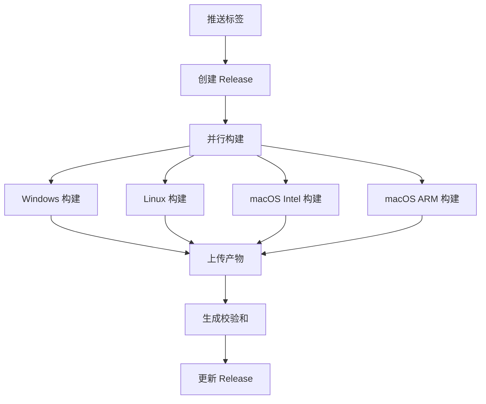

# GitHub Actions 配置说明

本文档说明如何配置和使用项目的 GitHub Actions 自动构建系统。

---

## 📋 工作流概览

项目包含两个主要工作流：

### 1. Release Build (release.yml)

**触发条件**：
- 推送 `v*.*.*` 格式的标签（如 `v0.2.0`）
- 手动触发（workflow_dispatch）

**功能**：
- 创建 GitHub Release
- 构建所有平台的安装包
- 上传构建产物
- 生成 SHA256 校验和

**构建平台**：
- Windows (x64)
- Linux (x64)
- macOS (Intel + Apple Silicon)

**构建时间**：约 15-30 分钟

---

### 2. Build Test (build-test.yml)

**触发条件**：
- 推送到 `main` 或 `develop` 分支
- 创建 Pull Request

**功能**：
- 运行前端构建测试
- 运行 Rust 单元测试
- 运行 Clippy 代码检查
- 构建调试版本

**目的**：确保代码质量，防止破坏性更改

---

## 🔧 初始配置

### 步骤 1: 启用 GitHub Actions

1. 访问仓库的 `Settings` -> `Actions` -> `General`
2. 确保 "Allow all actions and reusable workflows" 已启用
3. 保存设置

### 步骤 2: 配置权限

在 `Settings` -> `Actions` -> `General` -> `Workflow permissions`：

- ✅ 选择 "Read and write permissions"
- ✅ 勾选 "Allow GitHub Actions to create and approve pull requests"

### 步骤 3: 配置 Secrets（可选）

如果需要代码签名，在 `Settings` -> `Secrets and variables` -> `Actions` 添加：

| Secret 名称 | 说明 | 必需 |
|------------|------|------|
| `TAURI_SIGNING_PRIVATE_KEY` | Tauri 签名私钥 | 否 |
| `TAURI_SIGNING_PRIVATE_KEY_PASSWORD` | 私钥密码 | 否 |

**生成签名密钥**：
```bash
# 安装 Tauri CLI
cargo install tauri-cli

# 生成密钥对
cargo tauri signer generate -w ~/.tauri/myapp.key

# 查看公钥
cargo tauri signer sign -k ~/.tauri/myapp.key --password <password>
```

---

## 🚀 使用方法

### 自动发布新版本

```bash
# 1. 更新版本号
scripts\update-version.bat 0.2.0

# 2. 更新 CHANGELOG.md

# 3. 提交并打标签
git add .
git commit -m "chore: release v0.2.0"
git tag -a v0.2.0 -m "Release v0.2.0"

# 4. 推送（触发自动构建）
git push origin main
git push origin v0.2.0
```

### 手动触发构建

1. 访问 `Actions` 标签页
2. 选择 "Release Build" 工作流
3. 点击 "Run workflow"
4. 选择分支并运行

### 查看构建状态

1. 访问 `Actions` 标签页
2. 点击对应的工作流运行
3. 查看各个任务的执行状态和日志

---

## 📦 构建矩阵

### 平台配置

```yaml
matrix:
  include:
    - platform: windows-latest
      target: x86_64-pc-windows-msvc
    - platform: ubuntu-22.04
      target: x86_64-unknown-linux-gnu
    - platform: macos-latest
      target: x86_64-apple-darwin
    - platform: macos-latest
      target: aarch64-apple-darwin
```

### 添加新平台

编辑 `.github/workflows/release.yml`，在 `matrix.include` 中添加：

```yaml
- platform: ubuntu-22.04
  target: aarch64-unknown-linux-gnu  # ARM64 Linux
  rust: stable
```

---

## 🔍 工作流详解

### Release Build 流程



### 关键步骤说明

#### 1. 创建 Release

```yaml
- name: Create Release
  uses: actions/create-release@v1
  with:
    tag_name: ${{ github.ref }}
    release_name: VCP New Chat v${{ steps.version.outputs.version }}
    body: |
      ## 更新内容
      ...
```

#### 2. 安装依赖

**Linux**:
```yaml
- name: Install Linux dependencies
  run: |
    sudo apt-get update
    sudo apt-get install -y libwebkit2gtk-4.1-dev ...
```

**Windows/macOS**: 无需额外依赖

#### 3. 构建应用

```yaml
- name: Build Tauri app
  uses: tauri-apps/tauri-action@v0
  with:
    releaseId: ${{ needs.create-release.outputs.release_id }}
    args: --target ${{ matrix.target }}
```

#### 4. 生成校验和

```yaml
- name: Generate checksums
  run: |
    find . -type f -name "*.exe" -exec sha256sum {} \;
```

---

## 🐛 故障排除

### 问题：构建超时

**原因**：GitHub Actions 免费版有时间限制（6 小时）

**解决方案**：
1. 优化构建缓存
2. 减少构建目标
3. 使用自托管 Runner

### 问题：依赖安装失败

**Linux 依赖问题**：
```yaml
# 更新包列表
sudo apt-get update

# 安装缺失的依赖
sudo apt-get install -y <package-name>
```

**Rust 工具链问题**：
```yaml
# 指定 Rust 版本
- uses: dtolnay/rust-toolchain@stable
  with:
    toolchain: 1.70.0  # 固定版本
```

### 问题：权限错误

**解决方案**：

1. 检查 Workflow permissions 设置
2. 确保 `GITHUB_TOKEN` 有足够权限
3. 检查分支保护规则

### 问题：构建产物缺失

**检查清单**：
- [ ] `tauri.conf.json` 中 `bundle` 配置正确
- [ ] 目标平台支持该格式
- [ ] 构建日志无错误
- [ ] 文件路径正确

---

## 📊 性能优化

### 1. 使用缓存

```yaml
- name: Rust cache
  uses: swatinem/rust-cache@v2
  with:
    workspaces: './src-tauri -> target'

- name: Node cache
  uses: actions/setup-node@v4
  with:
    cache: 'npm'
```

### 2. 并行构建

```yaml
strategy:
  fail-fast: false  # 一个失败不影响其他
  matrix:
    platform: [windows-latest, ubuntu-22.04, macos-latest]
```

### 3. 条件执行

```yaml
- name: Install Linux dependencies
  if: matrix.platform == 'ubuntu-22.04'
  run: |
    sudo apt-get install ...
```

---

## 🔐 安全最佳实践

### 1. 保护 Secrets

- ❌ 不要在日志中打印 Secrets
- ✅ 使用 GitHub Secrets 存储敏感信息
- ✅ 定期轮换密钥

### 2. 最小权限原则

```yaml
permissions:
  contents: write  # 仅需要的权限
  packages: read
```

### 3. 依赖固定

```yaml
# ✅ 推荐：固定版本
uses: actions/checkout@v4

# ❌ 避免：使用 latest
uses: actions/checkout@latest
```

---

## 📈 监控和通知

### 添加构建状态徽章

在 `README.md` 中添加：

```markdown
[](https://github.com/你的用户名/vcpnewchat-tauri/actions)
```

### 配置通知

在 `Settings` -> `Notifications` 中配置：
- 构建失败时发送邮件
- 构建成功时发送通知

---

## 🔗 相关资源

- [GitHub Actions 文档](https://docs.github.com/en/actions)
- [Tauri Action](https://github.com/tauri-apps/tauri-action)
- [语义化版本](https://semver.org/)
- [Keep a Changelog](https://keepachangelog.com/)

---

## 📝 自定义工作流

### 添加测试步骤

```yaml
- name: Run tests
  run: |
    npm test
    cd src-tauri && cargo test
```

### 添加代码检查

```yaml
- name: Lint
  run: |
    npm run lint
    cd src-tauri && cargo clippy
```

### 添加部署步骤

```yaml
- name: Deploy to server
  if: github.ref == 'refs/heads/main'
  run: |
    # 部署脚本
```

---

## 💡 提示

1. **首次运行可能较慢**：需要下载依赖和构建缓存
2. **并行构建节省时间**：多个平台同时构建
3. **使用缓存加速**：Rust 和 Node 依赖缓存
4. **定期更新 Actions**：保持工作流使用最新版本
5. **监控配额使用**：GitHub 免费版有使用限制

---

## 🆘 获取帮助

- 查看 [GitHub Actions 日志](../../actions)
- 提交 [Issue](../../issues)
- 查看 [Tauri 文档](https://tauri.app/v1/guides/building/)
