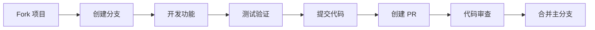

<div align="center">

# VCP New Chat - Tauri Edition

[](https://tauri.app/)
[](https://www.rust-lang.org/)
[](https://vitejs.dev/)
[](./LICENSE)

**基于 Tauri 2.0 框架重构的 VCPChat 桌面应用**

轻量 · 安全 · 高性能

[快速开始](#-快速开始) · [功能特性](#-核心特性) · [开发文档](#-开发指南) · [贡献指南](#-贡献指南)

</div>

---

## 📖 目录

- [项目简介](#-项目简介)
- [核心特性](#-核心特性)
- [技术栈](#-技术栈)
- [快速开始](#-快速开始)
- [开发指南](#-开发指南)
- [项目结构](#-项目结构)
- [配置说明](#-配置说明)
- [构建部署](#-构建部署)
- [常见问题](#-常见问题)
- [贡献指南](#-贡献指南)
- [许可证](#-许可证)

---

## 🎯 项目简介

VCP New Chat 是 VCPChat 项目的 Tauri 2.0 重构版本，采用现代化的技术栈，提供更优秀的桌面应用体验。

### 架构设计

**核心理念：前后端分离，职责明确**

```
┌─────────────────────────────────────────────────────────┐
│                    VCP New Chat                         │
│              (Tauri 2.0 Desktop Client)                 │
│                                                         │
│  ┌─────────────────┐      ┌──────────────────┐        │
│  │   Frontend UI   │◄────►│   Rust Backend   │        │
│  │  (Vite + JS)    │      │  (File I/O, IPC) │        │
│  └─────────────────┘      └──────────────────┘        │
└─────────────────────────────────────────────────────────┘
                        │
                        │ HTTP/WebSocket
                        ▼
┌─────────────────────────────────────────────────────────┐
│                   VCPToolBox Server                     │
│         (AI Inference, Tools, Python Scripts)           │
└─────────────────────────────────────────────────────────┘
```

**职责划分**

| 组件 | 职责 | 技术栈 |
|------|------|--------|
| **Tauri 客户端** | UI/UX、本地数据管理、配置存储 | Rust + Vite + JavaScript |
| **VCPToolBox 服务器** | AI 推理、工具执行、多媒体处理 | Python + FastAPI |

**架构优势**

- ✅ **轻量高效** - 客户端体积小、启动快、资源占用低
- ✅ **安全可靠** - Rust 内存安全保证，Tauri 沙箱隔离
- ✅ **易于扩展** - 前后端解耦，服务器端可独立升级
- ✅ **多端共享** - 多客户端可共享同一服务器实例

> 📖 **详细文档**：[开发进度](./开发进度.md) · [技术规范](./技术规范.md)

---

## ✨ 核心特性

### 已实现功能

<table>
<tr>
<td width="50%">

**🤖 智能对话**
- ✅ Agent 管理（创建、编辑、删除）
- ✅ 群聊支持（多 Agent 协作）
- ✅ 话题管理（创建、切换、搜索）
- ✅ 聊天历史持久化
- ✅ 流式响应渲染

</td>
<td width="50%">

**🎨 界面体验**
- ✅ 自定义标题栏
- ✅ 主题系统（日间/夜间模式）
- ✅ 响应式布局
- ✅ 拖拽排序
- ✅ 搜索与过滤

</td>
</tr>
<tr>
<td>

**📝 内容管理**
- ✅ Markdown 渲染
- ✅ 代码高亮
- ✅ 图片预览
- ✅ 文件附件
- ✅ 笔记模块

</td>
<td>

**🔧 系统功能**
- ✅ 本地数据存储
- ✅ 配置管理
- ✅ 热重载开发
- ✅ 跨平台支持
- ✅ 自动更新（规划中）

</td>
</tr>
</table>

> 📊 **完整功能清单**：查看 [开发进度文档](./开发进度.md)

---

## 🛠️ 技术栈

<table>
<tr>
<th>类别</th>
<th>技术</th>
<th>说明</th>
</tr>
<tr>
<td><strong>桌面框架</strong></td>
<td>Tauri 2.0</td>
<td>轻量级桌面应用框架</td>
</tr>
<tr>
<td><strong>后端语言</strong></td>
<td>Rust</td>
<td>系统级编程，内存安全</td>
</tr>
<tr>
<td><strong>前端构建</strong></td>
<td>Vite 5.x</td>
<td>快速的前端构建工具</td>
</tr>
<tr>
<td><strong>前端技术</strong></td>
<td>JavaScript/HTML/CSS</td>
<td>原生 Web 技术，无框架依赖</td>
</tr>
<tr>
<td><strong>通信协议</strong></td>
<td>HTTP/WebSocket</td>
<td>与 VCPToolBox 服务器通信</td>
</tr>
<tr>
<td><strong>包管理</strong></td>
<td>Cargo + NPM/PNPM</td>
<td>Rust 和 Node.js 依赖管理</td>
</tr>
</table>

---

## 🚀 快速开始

### 环境要求

| 软件 | 版本要求 | 安装方式 |
|------|---------|---------|
| **Node.js** | v16+ | [官网下载](https://nodejs.org/) |
| **Rust** | 最新稳定版 | [官网安装](https://www.rust-lang.org/tools/install) |
| **系统依赖** | - | 见下方平台说明 |

#### Windows 系统依赖

```powershell
# 安装 Rust（推荐使用 winget）
winget install --id Rustlang.Rustup

# 或访问官网下载 rustup-init.exe
# https://www.rust-lang.org/tools/install
```

**必需组件**：
- Microsoft C++ Build Tools
- WebView2（Windows 10/11 通常已预装）

#### Linux 系统依赖

<details>
<summary><strong>Ubuntu/Debian</strong></summary>

```bash
sudo apt update
sudo apt install libwebkit2gtk-4.1-dev \
    build-essential \
    curl \
    wget \
    file \
    libxdo-dev \
    libssl-dev \
    libayatana-appindicator3-dev \
    librsvg2-dev
```
</details>

<details>
<summary><strong>Fedora</strong></summary>

```bash
sudo dnf install webkit2gtk4.1-devel.x86_64 \
    openssl-devel \
    curl \
    wget \
    file \
    libX11-devel \
    libappindicator \
    librsvg2-devel
```
</details>

<details>
<summary><strong>Arch Linux</strong></summary>

```bash
sudo pacman -S webkit2gtk \
    base-devel \
    curl \
    wget \
    file \
    openssl \
    libappindicator \
    librsvg \
    libxdo
```
</details>

#### macOS 系统依赖

```bash
# 安装 Xcode Command Line Tools
xcode-select --install
```

### 安装步骤

```bash
# 1. 克隆项目
git clone <repository-url>
cd vcpnewchat-tauri

# 2. 安装前端依赖
npm install
# 或使用 pnpm（推荐）
pnpm install

# 3. 更新 Rust 工具链（可选）
rustup update

# 4. 启动开发服务器
npm run tauri dev
```

### 验证安装

```bash
# 检查 Node.js
node --version

# 检查 Rust
rustc --version
cargo --version

# 检查 Tauri CLI
cargo tauri --version
```

---

## 💻 开发指南

### 系统要求

### Windows
- **操作系统**: Windows 10 (1809+) 或 Windows 11
- **WebView2 运行时**: Microsoft Edge WebView2 Runtime
  - Windows 11 自带
  - Windows 10 需要安装：[下载 WebView2 Runtime](https://developer.microsoft.com/zh-cn/microsoft-edge/webview2/)
- **Visual C++ 运行库**: Microsoft Visual C++ 2015-2022 Redistributable
  - [下载 x64 版本](https://aka.ms/vs/17/release/vc_redist.x64.exe)

### 快速检查系统依赖

**方式一：完整版检查工具（推荐）**
```bash
# 双击运行（会自动检测并提示安装缺失的组件）
.\检查系统依赖.bat

# 或者手动运行 PowerShell 脚本
powershell -ExecutionPolicy Bypass -File check-dependencies.ps1
```

**方式二：简化版检查工具（如果完整版无法运行）**
```bash
# 双击运行（纯批处理，无需 PowerShell）
.\检查系统依赖-简化版.bat
```

**检查内容包括**:
- ✓ 操作系统版本
- ✓ WebView2 运行时
- ✓ Visual C++ 运行库
- ✓ 关键 DLL 文件 (msvcp140.dll, vcruntime140.dll 等)
- ✓ .NET Framework（完整版）
- ✓ 系统更新状态（完整版）

**完整版特性**: 自动下载并安装缺失的组件  
**简化版特性**: 纯批处理实现，兼容性更好，但需要手动安装

详细依赖说明请查看 [DEPENDENCIES.md](DEPENDENCIES.md)

### 开发环境要求
- **Node.js**: 16.x 或更高版本
- **Rust**: 1.70 或更高版本
- **Tauri CLI**: 2.x

## 故障排除

### 问题：应用启动后白屏

**可能原因和解决方案：**

1. **运行诊断工具**
   ```bash
   # 双击运行诊断工具，收集详细信息
   .\diagnose.bat
   ```
   诊断报告会保存到桌面，包含系统信息、错误日志等

2. **运行测试页面**
   - 将 `test.html` 复制到打包后的应用目录
   - 修改应用启动 URL 为 `test.html` 测试各项功能
   - 查看哪些测试失败，针对性解决

3. **缺少 WebView2 运行时**
   ```bash
   # 检查是否安装 WebView2
   # 打开注册表编辑器，查找：
   # HKEY_LOCAL_MACHINE\SOFTWARE\WOW6432Node\Microsoft\EdgeUpdate\Clients\{F3017226-FE2A-4295-8BDF-00C3A9A7E4C5}
   
   # 或者直接下载安装：
   # https://go.microsoft.com/fwlink/p/?LinkId=2124703
   ```

4. **缺少 Visual C++ 运行库**
   - 下载并安装 [VC++ Redistributable](https://aka.ms/vs/17/release/vc_redist.x64.exe)

5. **防火墙或杀毒软件拦截**
   - 将应用添加到白名单
   - 临时关闭防火墙测试

6. **以管理员身份运行**
   - 右键应用程序，选择"以管理员身份运行"

7. **显卡驱动问题**
   - 更新显卡驱动到最新版本
   - 尝试禁用硬件加速

8. **查看错误日志**
   - 按 `F12` 打开开发者工具查看控制台错误
   - 检查 `AppData/logs` 目录下的日志文件
   - 查看 Windows 事件查看器中的应用程序错误

### 问题：启动页面显示错误

**解决方案：**
- 点击启动页面的"打开开发者工具"按钮查看详细错误
- 检查文件系统权限
- 确保所有依赖文件都已正确打包

### 问题：资源加载失败 (500 错误)

**解决方案：**
```bash
# 重新构建前端资源
cd vcpnewchat-tauri
npm run build

# 确保 dist 目录包含所有必要文件
# - splash.html
# - index.html
# - assets/icon.png
# - vendor/Sortable.min.js
```

## 开发模式
```bash
# 首次安装依赖
cd f:\woker\vcp\vcpnewchat-tauri && npm install

# 启动开发服务器（带热重载）
cd f:\woker\vcp\vcpnewchat-tauri && npm run tauri dev

# 或者分步执行：
# 1. 编译前端
cd f:\woker\vcp\vcpnewchat-tauri && npm run build

# 2. 编译后端（Rust）
cd f:\woker\vcp\vcpnewchat-tauri\src-tauri && cargo build --release

# 3. 运行编译后的程序
cd f:\woker\vcp\vcpnewchat-tauri\src-tauri && cargo run --release
```

### 打包发布
```bash
# 或者使用 Tauri CLI 直接打包
cd f:\woker\vcp\vcpnewchat-tauri && npm run tauri build
```

### 常用命令
```bash
# 清理构建缓存
cd f:\woker\vcp\vcpnewchat-tauri && rmdir /s /q dist
cd f:\woker\vcp\vcpnewchat-tauri\src-tauri && cargo clean

# 仅构建前端
cd f:\woker\vcp\vcpnewchat-tauri && npm run build

# 仅构建后端
cd f:\woker\vcp\vcpnewchat-tauri\src-tauri && cargo build --release

# 检查 Rust 代码
cd f:\woker\vcp\vcpnewchat-tauri\src-tauri && cargo check

# 更新依赖
cd f:\woker\vcp\vcpnewchat-tauri && npm update
cd f:\woker\vcp\vcpnewchat-tauri\src-tauri && cargo update
```

**开发服务器特性**：
- 🔥 前端代码热重载
- 🐛 开发者工具（F12）
- 📝 控制台日志输出
- ⚡ 快速迭代开发

### 开发者工具配置

开发者工具（DevTools）可以在开发和生产模式下启用，方便调试。

#### 启用开发者工具

编辑 `src-tauri/tauri.conf.json`：

```json
{
  "app": {
    "windows": [
      {
        "devtools": true  // ✅ 启用开发者工具
      }
    ]
  }
}
```

#### 使用开发者工具

- **打开方式**：按 `F12` 或右键选择"检查元素"
- **功能**：
  - Console - 查看日志和错误
  - Network - 监控网络请求
  - Elements - 检查 DOM 结构
  - Sources - 调试 JavaScript 代码
  - Performance - 性能分析

#### 发布版本注意事项

⚠️ **重要**：发布生产版本前，建议关闭开发者工具以提升安全性和性能。

```json
{
  "app": {
    "windows": [
      {
        "devtools": false  // ❌ 生产环境关闭
      }
    ]
  }
}
```

**或者**使用环境变量控制（推荐）：

```rust
// src-tauri/src/main.rs
fn main() {
    tauri::Builder::default()
        .setup(|app| {
            #[cfg(debug_assertions)]
            {
                let window = app.get_webview_window("main").unwrap();
                window.open_devtools();
            }
            Ok(())
        })
        .run(tauri::generate_context!())
        .expect("error while running tauri application");
}
```

这样开发版本自动启用，生产版本自动禁用。

### 添加 Tauri 命令

**1. 定义 Rust 命令**

编辑 `src-tauri/src/lib.rs`：

```rust
#[tauri::command]
async fn your_new_command(param: String) -> Result<String, String> {
    // 实现业务逻辑
    Ok(format!("处理参数: {}", param))
}
```

**2. 注册命令**

在 `main()` 函数中注册：

```rust
fn main() {
    tauri::Builder::default()
        .invoke_handler(tauri::generate_handler![
            // ... 其他命令
            your_new_command
        ])
        .run(tauri::generate_context!())
        .expect("error while running tauri application");
}
```

**3. 前端调用**

```javascript
import { invoke } from '@tauri-apps/api/core';

try {
    const result = await invoke('your_new_command', { 
        param: 'value' 
    });
    //console.log('结果:', result);
} catch (error) {
    console.error('调用失败:', error);
}
```

### 项目结构

```
vcpnewchat-tauri/
├── 📁 src-tauri/              # Rust 后端
│   ├── src/
│   │   ├── main.rs            # 应用入口
│   │   ├── lib.rs             # Tauri 命令定义
│   │   └── theme.rs           # 主题管理
│   ├── Cargo.toml             # Rust 依赖
│   ├── tauri.conf.json        # Tauri 配置
│   └── icons/                 # 应用图标
│
├── 📁 modules/                # 功能模块
│   ├── Assistantmodules/      # 助手模块
│   ├── Groupmodules/          # 群聊模块
│   ├── Notemodules/           # 笔记模块
│   ├── Themesmodules/         # 主题模块
│   ├── renderer/              # 渲染器
│   └── utils/                 # 工具函数
│
├── 📁 styles/                 # 样式文件
│   ├── base.css               # 基础样式
│   ├── components.css         # 组件样式
│   ├── layout.css             # 布局样式
│   └── themes.css             # 主题样式
│
├── 📁 AppData/                # 应用数据（运行时生成）
│   ├── Agents/                # Agent 配置
│   ├── AgentGroups/           # 群聊配置
│   ├── UserData/              # 用户数据
│   └── settings.json          # 全局设置
│
├── 📄 index.html              # 主界面
├── 📄 renderer.js             # 前端主逻辑
├── 📄 vite.config.js          # Vite 配置
├── 📄 package.json            # Node.js 依赖
└── 📄 README.md               # 项目文档
```

### 调试技巧

#### 前端调试

**开启开发者工具**：
- 按 `F12` 打开开发者工具
- 或右键点击页面选择"检查元素"

**调试方法**：

```javascript
// 1. 使用 //console.log
//console.log('调试信息:', data);
console.error('错误信息:', error);
console.warn('警告信息:', warning);

// 2. 使用 debugger
debugger; // 代码会在此处暂停

// 3. 使用 console.table（查看对象数组）
console.table(arrayOfObjects);

// 4. 使用 console.time（性能测试）
console.time('操作耗时');
// ... 执行操作
console.timeEnd('操作耗时');
```

**开发者工具面板**：
- **Console** - 查看日志、执行 JavaScript
- **Network** - 监控 API 请求和响应
- **Elements** - 检查和修改 DOM
- **Sources** - 设置断点调试
- **Performance** - 性能分析和优化

#### 后端调试

```rust
// 1. 使用 println!
println!("调试信息: {:?}", data);

// 2. 使用 dbg! 宏
dbg!(&variable);

// 3. 启用详细日志
// 设置环境变量 RUST_LOG=debug
```

#### IPC 通信调试

```javascript
// 前端调用示例
const { invoke } = window.__TAURI__.core;

//console.log('调用命令: get_agent_topics');
const result = await invoke('get_agent_topics', { 
    agentId: 'agent-001' 
});
//console.log('返回结果:', result);
```

### 代码规范

#### 命名约定

| 类型 | 规范 | 示例 |
|------|------|------|
| Rust 函数/变量 | `snake_case` | `get_agent_topics` |
| JavaScript 函数 | `camelCase` | `loadAllTopics` |
| CSS 类名 | `kebab-case` | `topic-list-item` |
| 常量 | `UPPER_SNAKE_CASE` | `MAX_RETRY_COUNT` |

#### 文件组织

```javascript
// ✅ 推荐：模块化组织
modules/
  ├── chatManager.js      // 聊天管理
  ├── topicManager.js     // 话题管理
  └── utils/
      ├── api.js          // API 调用
      └── helpers.js      // 辅助函数

// ❌ 避免：单文件过大
renderer.js  // 5000+ 行代码
```

#### 错误处理

```rust
// Rust 后端
#[tauri::command]
async fn risky_operation() -> Result<String, String> {
    match perform_operation() {
        Ok(result) => Ok(result),
        Err(e) => Err(format!("操作失败: {}", e))
    }
}
```

```javascript
// JavaScript 前端
try {
    const result = await invoke('risky_operation');
    // 处理成功结果
} catch (error) {
    console.error('操作失败:', error);
    // 显示用户友好的错误提示
}
```

---

## 📦 构建部署

### 发布前准备

在构建生产版本前，请确保：

1. **关闭开发者工具**（推荐）

   编辑 `src-tauri/tauri.conf.json`：
   ```json
   {
     "app": {
       "windows": [
         {
           "devtools": false  // ❌ 生产环境关闭
         }
       ]
     }
   }
   ```

2. **清理调试代码**
   - 移除 `//console.log()` 调试语句
   - 移除 `debugger` 断点
   - 检查是否有测试代码残留

3. **更新版本号**
   
   编辑 `src-tauri/tauri.conf.json`：
   ```json
   {
     "version": "0.2.0",  // 更新版本号
     "productName": "VCP Chat - tauri版v0.2.0"
   }
   ```

### 开发构建

```bash
# 快速构建（调试版本）
npm run tauri build -- --debug

# 启用详细日志
set RUST_LOG=debug && npm run tauri build -- --debug
```

### 生产构建

```bash
# 构建优化的发布版本
npm run tauri build

# 仅构建可执行文件（跳过安装包）
npm run tauri build -- --bundles none
```

### 构建产物

#### Windows

```
src-tauri/target/release/
├── vcpnewchat.exe          # ✅ 绿色版（推荐）
└── bundle/
    ├── msi/                # MSI 安装程序
    └── nsis/               # NSIS 安装程序
```

**绿色版特点**：
- ✅ 单文件可执行，无需安装
- ✅ 不写入注册表
- ✅ 可放在任意目录运行
- ✅ 配置文件存储在 `AppData` 目录

#### Linux

```
src-tauri/target/x86_64-unknown-linux-gnu/release/
├── vcpnewchat              # 可执行文件
└── bundle/
    ├── deb/                # Debian 包
    ├── appimage/           # AppImage
    └── rpm/                # RPM 包
```

#### macOS

```
src-tauri/target/aarch64-apple-darwin/release/
├── vcpnewchat.app         # 应用程序包
└── bundle/
    ├── dmg/                # DMG 磁盘镜像
    └── macos/              # macOS 安装包
```

### 跨平台编译

<details>
<summary><strong>Windows 平台</strong></summary>

```bash
# 当前平台（默认）
npm run tauri build

# 只生成绿色版（推荐）
npm run tauri build -- --bundles none
```
</details>

<details>
<summary><strong>Linux 平台</strong></summary>

```bash
# x64 (64位)
npm run tauri build -- --target x86_64-unknown-linux-gnu

# ARM64
npm run tauri build -- --target aarch64-unknown-linux-gnu

# ARMv7
npm run tauri build -- --target armv7-unknown-linux-gnueabihf
```
</details>

<details>
<summary><strong>macOS 平台</strong></summary>

```bash
# Intel (x64)
npm run tauri build -- --target x86_64-apple-darwin

# Apple Silicon (ARM64)
npm run tauri build -- --target aarch64-apple-darwin

# 通用二进制（Universal Binary）
npm run tauri build -- --target universal-apple-darwin
```
</details>

<details>
<summary><strong>移动平台</strong></summary>

**iOS**:
```bash
# 安装工具链
rustup target add aarch64-apple-ios

# 真机构建
npm run tauri build -- --target aarch64-apple-ios

# 模拟器构建
npm run tauri build -- --target aarch64-apple-ios-sim
```

**Android**:
```bash
# 安装工具链
rustup target add aarch64-linux-android
cargo install cargo-ndk

# ARM64 构建（推荐）
npm run tauri build -- --target aarch64-linux-android
```
</details>

### 清理与重建

```bash
# 清理前端依赖
Remove-Item -Recurse -Force node_modules
npm install

# 清理 Rust 构建缓存
cd src-tauri
cargo clean

# 重新构建
cd ..
npm run tauri build
```

### 查看可用目标

```bash
# 查看已安装的目标
rustup target list --installed

# 查看所有可用目标
rustup target list

# 安装新目标
rustup target add <target-triple>
```

---

## ⚙️ 配置说明

### VCPToolBox 服务器配置

应用需要连接到 VCPToolBox 服务器才能使用 AI 功能。

**配置步骤**：

1. **启动 VCPToolBox 服务器**
   ```bash
   # 参考 VCPToolBox 项目文档
   python main.py
   ```

2. **配置服务器地址**
   
   编辑 `AppData/settings.json`（首次运行后自动创建）：
   ```json
   {
     "vcpServerUrl": "http://localhost:3000",
     "vcpApiKey": "your-api-key"
   }
   ```

3. **测试连接**
   ```bash
   # 测试服务器是否可达
   curl http://localhost:3000/health
   ```

**服务器要求**：
- ✅ 支持 `/v1/chat/completions` 端点（OpenAI 兼容）
- ✅ 支持 VCP 协议工具调用标记
- ✅ 支持流式响应（可选）

### 应用配置

#### Tauri 配置

编辑 `src-tauri/tauri.conf.json`：

```json
{
  "productName": "VCP New Chat",
  "version": "0.1.0",
  "identifier": "com.vcp.newchat",
  "build": {
    "beforeDevCommand": "npm run dev",
    "beforeBuildCommand": "npm run build",
    "devUrl": "http://localhost:1421"
  },
  "app": {
    "windows": [{
      "title": "VCP New Chat",
      "width": 1200,
      "height": 800,
      "decorations": false
    }]
  }
}
```

#### Vite 配置

编辑 `vite.config.js`：

```javascript
export default defineConfig({
  server: {
    port: 1421,           // 开发服务器端口
    strictPort: true,     // 端口被占用时报错
    cors: true,           // 启用 CORS
    host: '127.0.0.1'     // 监听地址
  }
});
```

### 数据存储

应用数据存储在 `AppData/` 目录：

```
AppData/
├── Agents/                    # Agent 配置
│   └── {agentId}/
│       └── config.json
├── AgentGroups/               # 群聊配置
│   └── {groupId}/
│       └── config.json
├── UserData/                  # 用户数据
│   └── {agentId}/
│       └── topics/
│           └── {topicId}/
│               └── history.json
└── settings.json              # 全局设置
```

**配置文件示例**：

<details>
<summary><code>settings.json</code></summary>

```json
{
  "vcpServerUrl": "http://localhost:3000",
  "vcpApiKey": "",
  "userName": "User",
  "theme": "dark",
  "enableSmoothStreaming": true,
  "minChunkBufferSize": 5
}
```
</details>

<details>
<summary><code>Agent config.json</code></summary>

```json
{
  "id": "agent-001",
  "name": "AI Assistant",
  "model": "gpt-4",
  "systemPrompt": "You are a helpful assistant.",
  "temperature": 0.7,
  "maxTokens": 2000
}
```
</details>

---

## 🐛 常见问题

### 编译与构建

<details>
<summary><strong>Q: 编译失败：找不到 Rust</strong></summary>

**解决方案**：

```bash
# Windows
winget install --id Rustlang.Rustup

# Linux/macOS
curl --proto '=https' --tlsv1.2 -sSf https://sh.rustup.rs | sh

# 验证安装
rustc --version
cargo --version
```
</details>

<details>
<summary><strong>Q: 前端依赖安装失败</strong></summary>

**解决方案**：

```bash
# 清除缓存
npm cache clean --force
rm -rf node_modules package-lock.json

# 重新安装
npm install

# 或使用 pnpm
pnpm install
```
</details>

<details>
<summary><strong>Q: 开发服务器启动失败（端口被占用）</strong></summary>

**解决方案**：

1. 修改 `vite.config.js` 中的端口：
   ```javascript
   export default defineConfig({
     server: {
       port: 1422,  // 改为其他端口
     }
   });
   ```

2. 同步修改 `src-tauri/tauri.conf.json`：
   ```json
   {
     "build": {
       "devUrl": "http://localhost:1422"
     }
   }
   ```
</details>

<details>
<summary><strong>Q: WiX Toolset 错误（Windows 打包失败）</strong></summary>

**解决方案**：

```bash
# 跳过安装包生成，只构建绿色版
npm run tauri build -- --bundles none
```

绿色版可执行文件位于：`src-tauri/target/release/vcpnewchat.exe`
</details>

### 运行时问题

<details>
<summary><strong>Q: 无法连接到 VCPToolBox 服务器</strong></summary>

**排查步骤**：

1. 确认服务器正在运行：
   ```bash
   curl http://localhost:3000/health
   ```

2. 检查配置文件 `AppData/settings.json`：
   ```json
   {
     "vcpServerUrl": "http://localhost:3000"
   }
   ```

3. 查看控制台错误信息（F12）
</details>

<details>
<summary><strong>Q: 应用启动后白屏</strong></summary>

**解决方案**：

1. 检查开发者工具（F12）的控制台错误
2. 确认 Vite 开发服务器正在运行
3. 清除缓存并重新构建：
   ```bash
   npm run build
   npm run tauri dev
   ```
</details>

<details>
<summary><strong>Q: 图标显示异常</strong></summary>

**解决方案**：

1. 确保图标文件为 `.ico` 格式（Windows）
2. 图标尺寸：256x256px
3. 位于 `src-tauri/icons/` 目录
4. 重新构建应用
</details>

### 开发问题

<details>
<summary><strong>Q: 如何启用开发者工具？</strong></summary>

**解决方案**：

1. **配置文件方式**（推荐）

   编辑 `src-tauri/tauri.conf.json`：
   ```json
   {
     "app": {
       "windows": [
         {
           "devtools": true
         }
       ]
     }
   }
   ```

2. **快捷键方式**
   - 按 `F12` 打开开发者工具
   - 右键点击页面选择"检查元素"

3. **代码方式**（仅开发模式）
   ```rust
   // src-tauri/src/main.rs
   #[cfg(debug_assertions)]
   {
       let window = app.get_webview_window("main").unwrap();
       window.open_devtools();
   }
   ```

**注意**：生产版本发布前建议关闭 `devtools`。
</details>

<details>
<summary><strong>Q: 开发者工具无法打开</strong></summary>

**排查步骤**：

1. 检查 `tauri.conf.json` 中 `devtools` 是否为 `true`
2. 确认是否在开发模式下运行（`npm run tauri dev`）
3. 尝试重启应用
4. 检查是否有快捷键冲突

**临时解决方案**：
```bash
# 使用环境变量强制启用
$env:TAURI_DEV_TOOLS = "1"
npm run tauri dev
```
</details>

<details>
<summary><strong>Q: Rust 代码修改后不生效</strong></summary>

**解决方案**：

Rust 代码修改后需要重启开发服务器：

```bash
# 停止当前服务器（Ctrl+C）
# 重新启动
npm run tauri dev
```
</details>

<details>
<summary><strong>Q: 前端热重载不工作</strong></summary>

**解决方案**：

1. 检查 Vite 配置是否正确
2. 确认文件保存成功
3. 查看终端是否有错误信息
4. 尝试手动刷新（Ctrl+R）
</details>

---

## 🤝 贡献指南

欢迎提交 Issue 和 Pull Request！

### 开发流程



### 提交前检查清单

- [ ] **代码质量**
  - [ ] Rust 代码通过 `cargo clippy` 检查
  - [ ] JavaScript 代码符合项目规范
  - [ ] 无明显的性能问题

- [ ] **功能测试**
  - [ ] 新功能正常工作
  - [ ] 未破坏现有功能
  - [ ] 跨平台兼容性（如适用）

- [ ] **文档更新**
  - [ ] 更新 README.md（如需要）
  - [ ] 更新 [开发进度.md](./开发进度.md)
  - [ ] 添加代码注释

- [ ] **提交规范**
  - [ ] 使用语义化提交信息
  - [ ] 提交信息清晰明确

### 提交信息规范

```bash
# 格式
<type>(<scope>): <subject>

# 类型（type）
feat:     新功能
fix:      Bug 修复
docs:     文档更新
style:    代码格式（不影响功能）
refactor: 重构（不是新功能也不是修复）
perf:     性能优化
test:     测试相关
chore:    构建/工具链相关

# 示例
feat(chat): 添加流式响应支持
fix(ui): 修复主题切换闪烁问题
docs(readme): 更新安装说明
```

### 代码审查标准

**Rust 代码**：
- ✅ 遵循 Rust 官方风格指南
- ✅ 使用 `cargo fmt` 格式化
- ✅ 通过 `cargo clippy` 检查
- ✅ 适当的错误处理

**JavaScript 代码**：
- ✅ 使用 ES6+ 语法
- ✅ 适当的注释
- ✅ 避免全局变量污染
- ✅ 模块化组织

### 获取帮助

- 📖 查看 [开发进度文档](./开发进度.md)
- 💬 提交 Issue 讨论
- 📧 联系维护者

---

## 📚 相关资源

### 官方文档

- [Tauri 官方文档](https://tauri.app/) - Tauri 框架文档
- [Rust 官方文档](https://www.rust-lang.org/) - Rust 编程语言
- [Vite 官方文档](https://vitejs.dev/) - Vite 构建工具

### 项目文档

- [开发进度](./开发进度.md) - 详细的开发进度和规划
- [技术规范](./技术规范.md) - 技术规范和最佳实践
- [VCP 协议](../VCP.md) - VCP 通信协议说明

### 相关项目

- [VCPChat](../VCPChat/) - Electron 版本的 VCPChat
- [VCPToolBox](https://github.com/lioensky/VCPToolBox) - VCP 服务器后端

### 社区资源

- [Tauri Discord](https://discord.com/invite/tauri) - Tauri 官方社区
- [Rust 中文社区](https://rust.cc/) - Rust 学习资源

---

## 📄 许可证

本项目采用 MIT 许可证。详见 [LICENSE](./LICENSE) 文件。

```
MIT License

Copyright (c) 2024 VCP New Chat

Permission is hereby granted, free of charge, to any person obtaining a copy
of this software and associated documentation files (the "Software"), to deal
in the Software without restriction...
```

---

## 🙏 致谢

感谢所有为本项目做出贡献的开发者！

特别感谢：
- [Tauri](https://tauri.app/) - 提供优秀的桌面应用框架
- [Rust](https://www.rust-lang.org/) - 提供安全高效的系统编程语言
- [Vite](https://vitejs.dev/) - 提供快速的前端构建工具

---

<div align="center">

**[⬆ 返回顶部](#vcp-new-chat---tauri-edition)**

Made with ❤️ by VCP Team

</div>